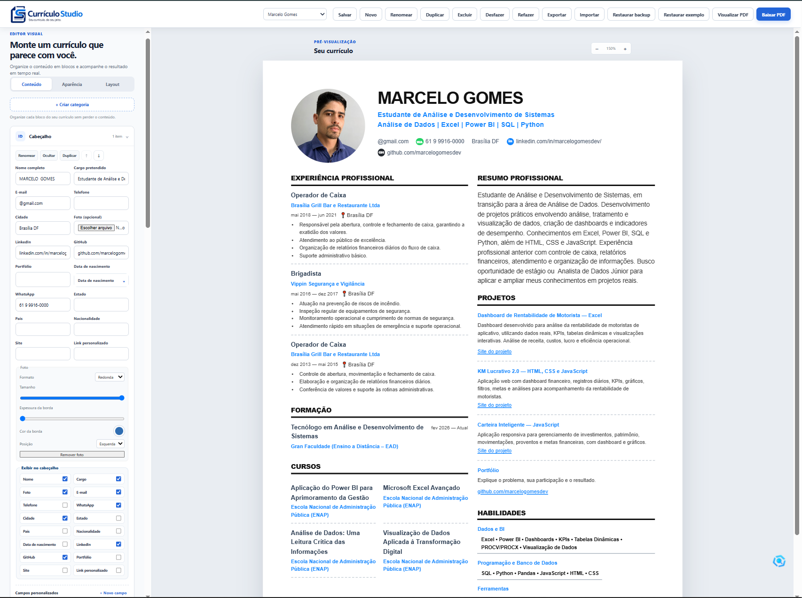
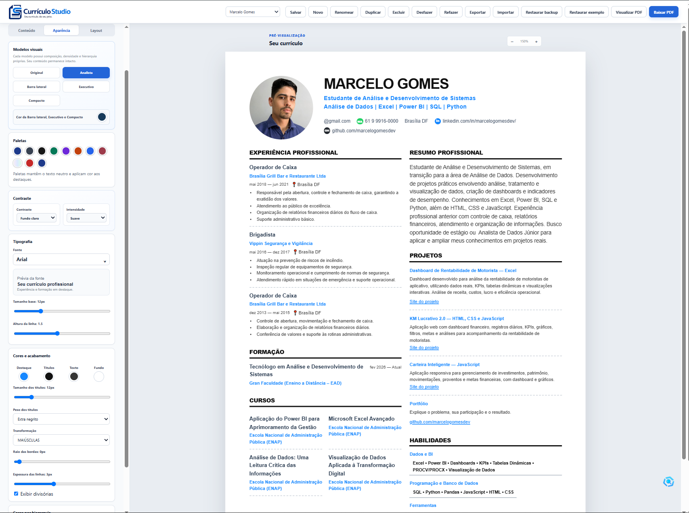

<p align="center">
  
</p>

<h1 align="center">📄 Currículo Studio</h1>

<p align="center">
  <strong>Seu currículo, do seu jeito.</strong>
</p>

<p align="center">
  Editor visual gratuito para criar currículos profissionais, personalizados e prontos para PDF diretamente no navegador.
</p>

<p align="center">
  <a href="https://marcelogomesdev.github.io/curriculo-studio/">
    🌐 <strong>Currículo Studio</strong>
  </a>
  &nbsp;&nbsp;•&nbsp;&nbsp;
  <a href="https://github.com/marcelogomesdev/curriculo-studio">
    📂 <strong>Repositório</strong>
  </a>
</p>

<p align="center">


</p>

---

# 📖 Sobre o Projeto

O **Currículo Studio** é um editor visual gratuito para criação de currículos profissionais diretamente no navegador.

A proposta do projeto é oferecer uma experiência semelhante a ferramentas como **Canva** e **Notion**, permitindo editar o currículo diretamente na folha A4, vendo exatamente como ficará o resultado final antes da exportação em PDF.

Desenvolvido utilizando apenas **HTML, CSS e JavaScript**, o projeto funciona totalmente no navegador, sem necessidade de cadastro, backend ou instalação.

---

# ✨ Principais Recursos

## 🎨 Editor Visual

- Edição inline diretamente na folha A4
- Atualização em tempo real
- Clique para editar qualquer informação
- Interface intuitiva
- Organização por arrastar e soltar

### Edição de conteúdo em tempo real



---

## 📄 Modelos de Currículo

O sistema conta com diversos modelos exclusivos:

- Original
- Analista
- Barra Lateral
- Executivo
- Compacto

Cada modelo possui identidade visual própria.

---

## 🎨 Personalização

Personalize praticamente todo o currículo:

- Paletas de cores
- Fontes
- Espaçamentos
- Margens
- Colunas
- Contraste
- Bordas
- Layout
- Aparência geral

### Personalização de aparência



---

## 💼 Recursos Profissionais

Crie currículos completos com:

- Experiências
- Formação Acadêmica
- Cursos
- Certificações
- Projetos
- Idiomas
- Habilidades
- Referências
- Voluntariado
- Categorias personalizadas
- Foto de perfil
- Logos
- Tecnologias
- LinkedIn
- GitHub
- WhatsApp

---

## 💾 Persistência

- Salvamento automático
- LocalStorage
- Histórico (Desfazer / Refazer)
- Backup automático
- Múltiplos currículos
- Importação JSON
- Exportação JSON

---

## 📄 Exportação

- PDF em alta qualidade
- Impressão otimizada
- Links preservados
- Visualização antes da impressão

---

# 🚀 Tecnologias

- HTML5
- CSS3
- JavaScript (ES6+)
- LocalStorage
- API nativa de impressão

---

# ▶️ Como Executar

Clone o projeto:

```bash
git clone https://github.com/marcelogomesdev/curriculo-studio.git
```

Entre na pasta:

```bash
cd curriculo-studio
```

Abra o arquivo:

```text
index.html
```

Ou utilize a extensão **Live Server** do Visual Studio Code.

---

# 📁 Estrutura do Projeto

```text
curriculo-studio/
│
├── css/
├── images/
├── js/
├── tests/
├── index.html
└── README.md
```

---

# 🧪 Testes

Com o Node.js instalado:

```bash
node tests/core.test.mjs
```

Os testes verificam:

- Estado da aplicação
- Persistência
- Histórico
- Backup
- Migração
- Múltiplos currículos

---

# 🗺️ Roadmap

## ✅ Implementado

- Editor visual em tempo real
- Diversos modelos profissionais
- Personalização completa
- Exportação para PDF
- Salvamento automático
- Histórico
- Backup
- Importação e Exportação JSON
- Interface responsiva

## 🚧 Próximas melhorias

- Novos modelos
- Biblioteca de ícones
- Temas adicionais
- Compartilhamento por link
- Melhorias de acessibilidade
- Mais opções de layout

---

# 👨‍💻 Autor

**Marcelo Gomes Dev**

🌐 Site: https://marcelogomesdev.github.io/curriculo-studio/

💻 GitHub: https://github.com/marcelogomesdev

💼 LinkedIn: https://www.linkedin.com/in/marcelogomesdev/

---

# 📄 Licença

Este projeto está licenciado sob a **Licença MIT**.

Sinta-se à vontade para estudar, modificar e contribuir com o projeto.